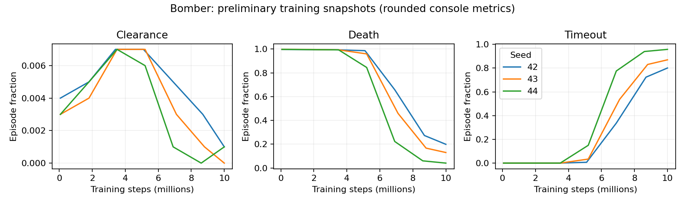

# Initial validation — 2026-09-09

The solo task passes mechanics and native-integration checks. The initial learned
policies fail the plan's performance acceptance criterion. They learn to avoid
bombs and time out, rather than reliably clear the arena. Duel and self-play are future milestones; these results do not establish learned-policy
performance.

## Correctness and integration

- ASan + UBSan C11 suite passed, including one million paired seed/action replay
  steps and 1,000 map connectivity/spawn checks.
- The same suite passed under C++17.
- Tests cover fuse placement timing, flame expiry and lethality, invalid numeric
  actions, leaving/re-entering bombs, bounded cyclic chains, existing-flame
  triggers, walls and crates, perpendicular simultaneous blast snapshots,
  duplicate shaping prevention, success/death/timeout auto-reset, logs, and
  complete observation/mask writes.
- GCC compiled the real native CPU viewer; NVCC compiled the native GPU trainer.
- A 32,768-step GPU smoke run completed with finite reported losses and logs.
- Three longer GPU runs and separate headless evaluations completed.
- No interactive renderer inspection or human-play demo was performed.

Initial training measurements used PufferLib commit
`036b7e46cfabd0ccdf02c50e0e8da873beac5658`. The environment was subsequently
ported onto upstream 5.0 commit
`adbe5cbb` for contribution. The C sanitizer suite, C++17 suite, native CPU
viewer build, native CUDA trainer build, and 32,768-step GPU smoke test all
passed again on that base. GCC/NVCC builds used the native entry
points and Raylib 5.5; the development host lacked the build script's clang and
ccache executables. No build-script modification is part of this contribution.

## Fixed-layout baselines

Default density 0.08, 400 ticks, shaping budget 0.2; initial RNG seeds
1000000–1000999, exactly one episode per map. Uniform random samples legal actions.
Intervals are 95% Wilson binomial intervals over those 1,000 maps.

| Controller | Clearances | Success (95% interval) | Death | Timeout |
|---|---:|---:|---:|---:|
| Always wait | 0/1000 | 0% (0–0.38%) | 0% | 100% |
| Masked random | 6/1000 | 0.6% (0.28–1.30%) | 99.4% | 0% |
| Scripted escape-and-bomb | 1000/1000 | 100% (99.62–100%) | 0% | 0% |

The scripted controller provides evidence that the default sparse task can be
solved within the horizon. It is a full-state search baseline, not a trained policy.

## First training trials

Policy and map seeds 42, 43, 44; 1,024 environments, four CPU threads, two buffers,
64-step horizon, 16,384 minibatch, 128 hidden units, one recurrent layer. Other
settings come from `config/bomber.ini` over the checked-out `config/default.ini`.
Requested 10 million steps; the trainer rounded down to 9,961,472 per run.

Separate stochastic headless evaluation used policy seed 123, map_seed=1000000,
256 environments, and at least 1,000 completed episodes. Because native evaluation
continues each slot's RNG stream and stops on a rollout boundary, the layouts and
counts differ from the fixed-layout baselines above. Do not interpret these as a
precisely matched statistical policy-vs-baseline comparison.

| Training seed | Evaluation clearances | Success (approx. 95% Wilson interval) | Death | Timeout |
|---|---:|---:|---:|---:|
| 42 | 2/1053 | 0.190% (0.052–0.690%) | 17.9% | 81.9% |
| 43 | 0/1037 | 0% (0–0.369%) | 15.3% | 84.7% |
| 44 | 0/1024 | 0% (0–0.374%) | 3.6% | 96.4% |

These episode-level intervals describe the sampled evaluation; only three policy
seeds were trained. The behavior is consistent with a survival/timeout local
optimum under sparse terminal rewards. More curriculum and training work is needed;
a reasonable next experiment is fixed one-crate training (`crate_density=0`) before
randomized layouts. No reward or default-mechanics changes were made to hide this
failure. Shaping ablation and matched fixed-map learned-policy evaluation remain.

`training_curves.csv` contains rounded console snapshots. Regenerate with
`python tests/plot_bomber.py` (requires matplotlib). Raw logs, resolved INI files,
and final checkpoints are in `build/bomber_experiment/`; those artifacts are local
and ignored by Git. `tests/train_bomber.sh` reproduces the trials and evaluation.

## Environment throughput

Hardware: AMD Ryzen 7 9800X3D, Linux x86_64; GCC 13.1.0, `-O3`, single thread.
Training used an NVIDIA GeForce RTX 3070 (8 GB), CUDA 12.9.

A dedicated 10,000,000-step, one-environment rollout measured **3.71 million steps/s**
(2.698 CPU seconds). It includes uniform six-action generation, simulation,
observation/mask writes, logs, and automatic resets; it excludes inference,
rendering, and training. Default maps and dynamics; map seed 42, action seed 73.
This short, cache-resident microbenchmark is not batched trainer throughput.
The scripted baseline including search measured about 257,000 steps/s over
64,271 simulation steps. No sustained training-throughput claim is made from the
short training runs' instantaneous console SPS values.
